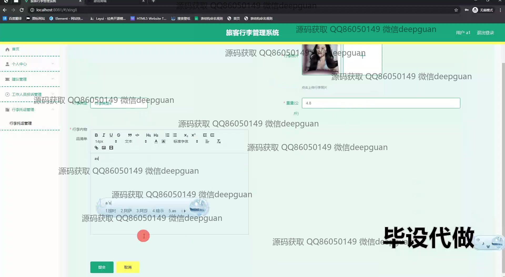

<h1 align="center">基于BS的旅客行李管理系统的设计与实现+vue</h1>

## 简介
旅客行李管理系统：角色分为用户和管理员；主要功能包括行李托运管理、用户信息管理、投诉管理、建议管理、支付功能、员工信息管理等，界面简洁，功能齐全。    --计算机毕业设计源码；毕设源码；java毕业设计源码

## 联系方式

<h3 align="center">获取完整代码与数据库文件 + 微信：deepguan QQ: 86050149 QQ群: 783742310</h3>

<h3 align="center">可帮忙远程部署 包运行成功！提供远程部署、修改代码、设计文档指导、代码讲解等服务！</h3>

## 功能介绍（完整见运行截图）
管理员：系统提供用户管理、行李托运管理、投诉管理等功能模块。管理人员可以查看、添加、修改或删除用户和行李信息，处理投诉记录，审核行李托运申请并管理系统的各类设置。管理员界面包括导航菜单和详细的数据列表，并有相应的搜索和过滤功能以提升管理效率。

用户：用户可以通过系统登录界面进入个人中心，查看和更新个人信息，管理托运行李申请，包括新增、查询、和支付托运费用。用户还可以提交建议或投诉，查看历史记录以及托运状态。系统提供了多样化的支付和信息管理方式，界面直观，便于操作。

## 运行截图

本代码来源于网络,仅供学习参考使用!

